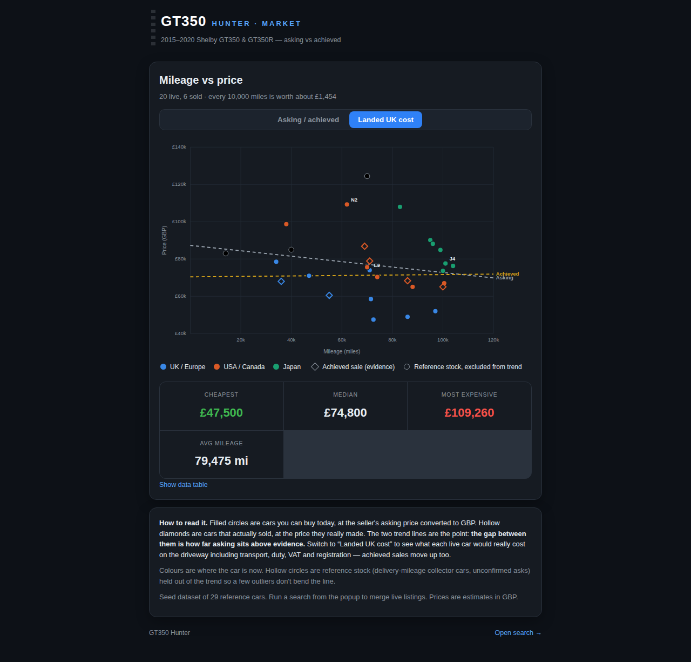

# GT350 Hunter — Shelby Mustang Finder (Chrome extension)

Searches multiple car marketplaces at once for a **2015–2020 Ford Mustang
Shelby GT350 / GT350R**, then plots the market as a **mileage-vs-price**
dashboard for a UK buyer — asking vs achieved prices, and the true **landed UK
cost** of importing an overseas car.



## What it does

- **One search, many sites.** Builds pre-filtered searches (year range +
  GT350/GT350R keyword) for every marketplace and, where a site allows it,
  previews the matching listings inline in the popup.
- **Market dashboard.** A mileage-vs-price scatter with two trend lines —
  **asking** vs **achieved (sold)** — so you can see how far asking sits above
  real evidence. Stat tiles show cheapest / median / most expensive / average
  mileage.
- **Landed UK cost.** Toggle between raw prices and the real cost on your
  driveway. Overseas cars are converted to GBP, then **+10% import duty, +20%
  VAT, +£3,000 shipping**. UK cars land as-is.
- **Region colours.** Where the car is now — UK/Europe, USA/Canada, Japan —
  using a colourblind-safe categorical palette (validated for the dark theme).

## Marketplaces covered

**UK (GBP):** AutoTrader UK · PistonHeads · eBay UK · Cazoo · Car & Classic

**USA / Canada (converted to GBP + import costs):** AutoTrader.com · Cars.com ·
CarGurus · Bring a Trailer · AutoTrader.ca

## Install (unpacked)

1. Open `chrome://extensions`.
2. Enable **Developer mode** (top right).
3. Click **Load unpacked** and select this folder (the one containing
   `manifest.json`).
4. Pin **GT350 Hunter** and click the toolbar icon.

## Using it

- Set the **year range** and **GT350 / GT350R / Both**, then **Search all
  sites**. Each site card shows how many matches were read, with the top
  listings; click a card to expand.
- **Open all ↗** launches every site's pre-filtered search in its own tab.
- **📊 Market dashboard** opens the mileage-vs-price view. It merges any live
  listings from your last search on top of a built-in seed dataset, so the
  chart is meaningful even before the first search.

## How the data works

- **Prices are estimates in GBP.** FX rates and the import-cost model live in
  [`src/data.js`](src/data.js) (`FX`, `importLanded`) — edit them to match
  current rates.
- **Live reads are best-effort.** Marketplaces frequently block automated
  requests (Cloudflare, bot checks) or change their markup. When a page can't
  be read, the extension falls back to the site's own **Open ↗** search, which
  is already filtered — nothing is silently dropped.
- **Seed dataset.** [`src/data.js`](src/data.js) ships a representative set of
  GT350/GT350R market points (live asking, completed sales, and held-out
  reference stock) so the dashboard demonstrates the asking-vs-achieved gap out
  of the box.

## Project layout

```
manifest.json          # MV3 manifest
src/
  sites.js             # marketplace definitions: search URLs + parsers
  data.js              # seed dataset, FX rates, landed-cost model, regions
  popup.html/.css/.js  # search launcher + live aggregator
  dashboard.html/.css/.js  # mileage-vs-price market dashboard
  background.js        # service worker (defaults + context menu)
icons/                 # generated Shelby-themed icons
```

## Notes & limitations

- Prices, FX and import costs are **estimates**, not quotes — verify duty/VAT
  treatment (e.g. classic/collector reliefs) for your specific import.
- The extension only reads publicly visible search pages and never logs in on
  your behalf. Respect each marketplace's terms of use.
